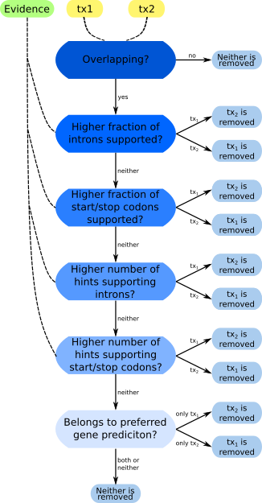

# PrEvCo
PrEvCo: gene Predcition and extrinsic Evidence Combiner
### Introduction
PrEvCo is a tool that combines multiple sets of gene predicitons. Gene predictions from multiple sources are combined using the evidence from hintfiles. A ‘decision rule’ (see Figure1) is simultaneously applied to all pairs of transcripts. All transcript that are not excluded form the combined gene prediciton.




Figure1: 'Decision Rule': Sequence of rules for comparing the extrinscic evidence support of all pairs of transcripts.
### Prerequisites
Python 3.5 or higher is required.
### Usage
The main script is ```./bin/prevco.py```. Run ```./bin/prevco.py --help``` for information about the usage and options of PrEvCo.
